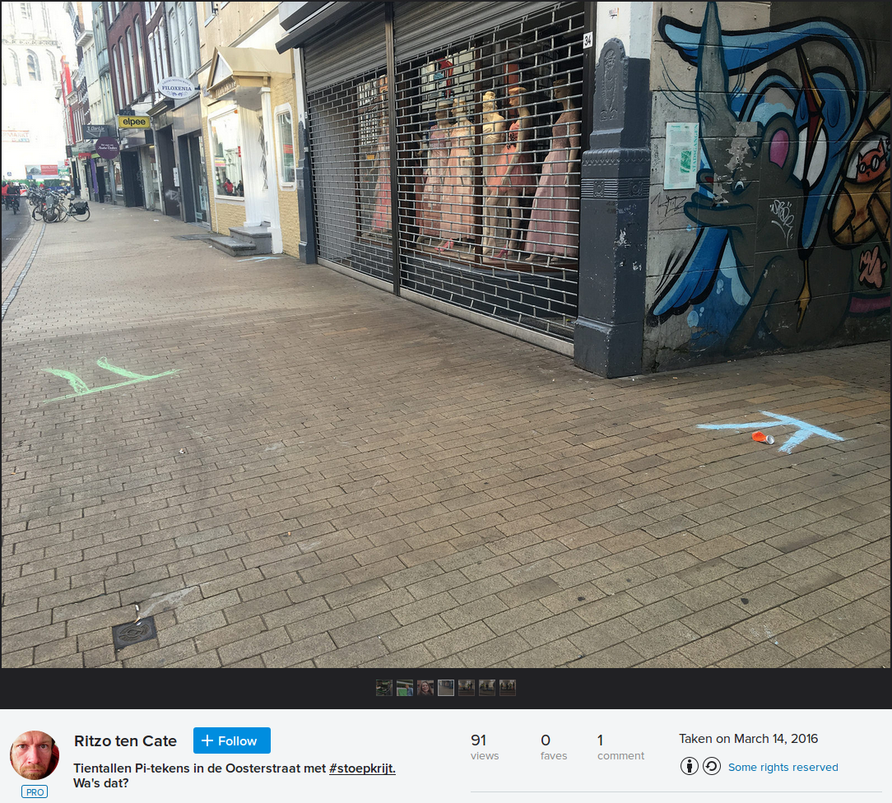
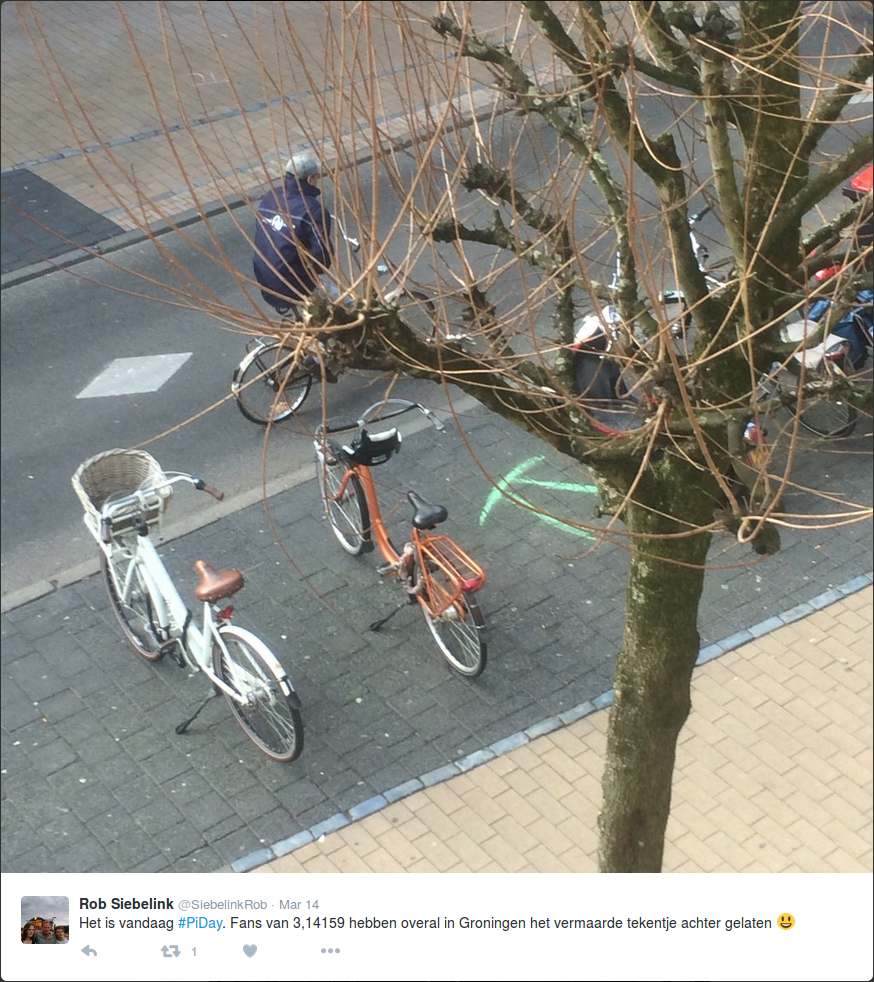
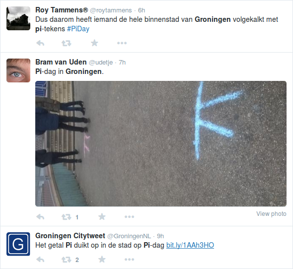
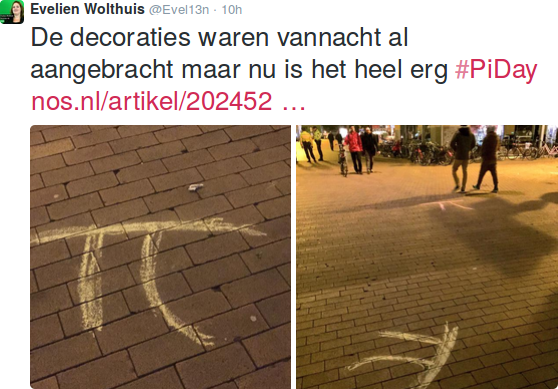
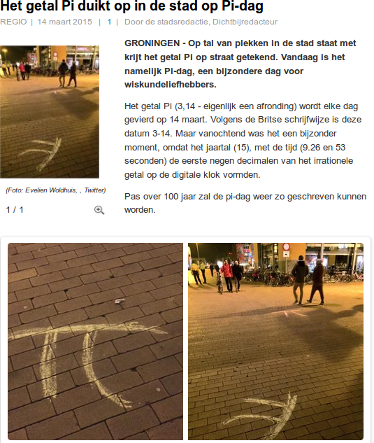
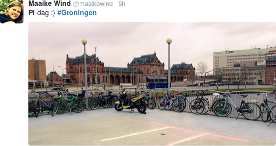
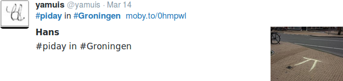
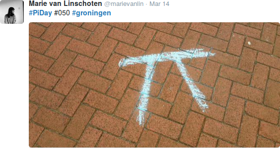
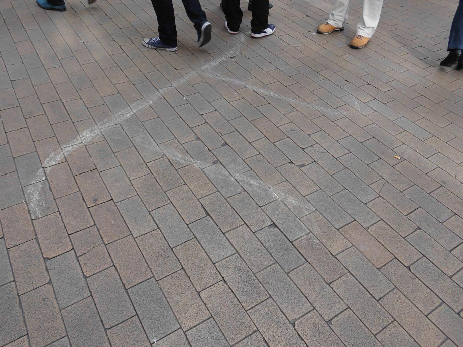
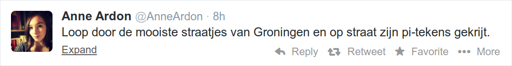

# pi_day

 * What: Celebrate Pi Day, a yearly festivity
 * When:
   * Gather: 23:57 o'clock on March 13th, a little bit more than three minutes before Pi Day
   * Leave: 0:03 o'clock on March 14th, a little bit more than three minutes in Pi Day
   * End: when all streetchalk has been used, approximately after an hour</li>
 * Where: bus stop P at Groningen Central Station
 * What to bring: a box of street chalk, for sale in most toy stores

If it is raining, this event is cancelled on March 13th 20:00, 
which will be displayed at this page here:

```
Status 2020: OK
```

## 2019

In 2015, I celebrated Pi day together with R de G and Q van der S-M, 
by drawing pi with streetchalk at the Groningen city center.


## 2018

In 2015, I celebrated Pi day together with ? by drawing pi with streetchalk 
at the Groningen city center.

## 2017

Monday morning, 0:03, me and C.IJ. went out and drew pi symbols with street chalk.
We cannot prove this, as nobody put their pictures online where we could find them.

## 2016

In 2015, I celebrated Pi day together with ? by drawing pi with streetchalk 
at the Groningen city center.





## 2015

In 2015, I celebrated Pi day together with C.T. and W.S. by drawing pi with streetchalk 
at the Groningen city center.




From [www.dichtbij.nl](http://www.dichtbij.nl/groningen/regionaal-nieuws/artikel/3937288/het-getal-pi-duikt-op-in-de-stad-op-pidag.aspx):






## 2014

In 2014 I celebrated Pi day together with C.D. be drawing pi with streetchalk 
at the Groningen city center.







