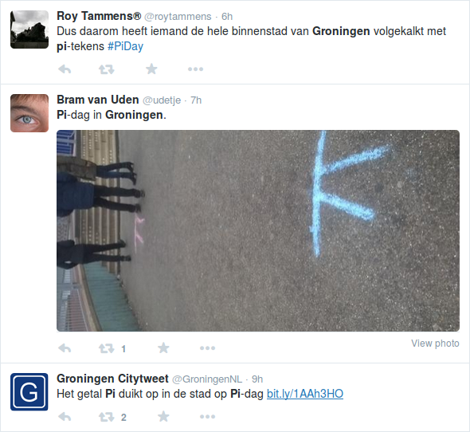
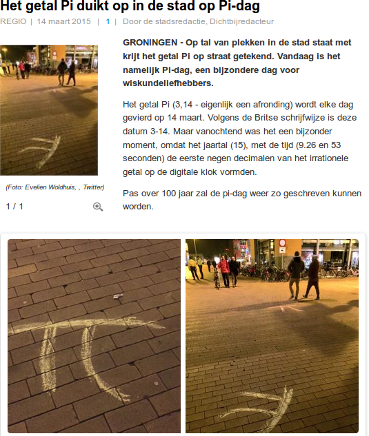
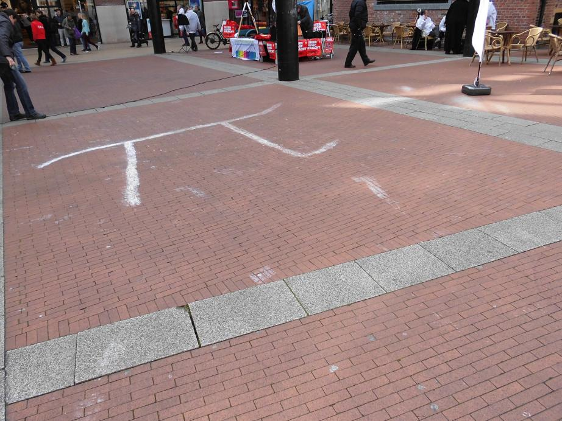
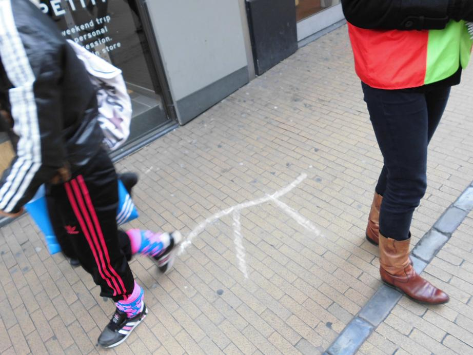
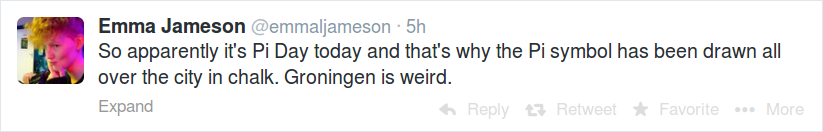

# Pi Day

 * What: Celebrate Pi Day, a yearly festivity
 * When:
   * Gather: 23:57 o'clock on March 13th, a little bit more than three minutes before Pi Day
   * Leave: 0:03 o'clock on March 14th, a little bit more than three minutes in Pi Day
   * End: when all streetchalk has been used, approximately after an hour
 * Where: bus stop P at Groningen Central Station
 * What to bring: a box of street chalk, for sale in most toy stores

If there is rain, the event will be cancelled. This will be shown here
at 2021-03-13. 

## 2020

In 2020, I celebrated Pi day together with BP and Q van der S-M, 
by drawing pi with streetchalk at the Groningen city center.

DS celebrated Pi Day in his own fashion:

## 2019

In 2019, I celebrated Pi day together with R de G and Q van der S-M, 
by drawing pi with streetchalk at the Groningen city center.

### [DVHN](https://www.dvhn.nl/groningen/Het-is-Pi-dag-Rich%C3%A8l-Bilderbeek-trekt-spoor-van-pis-door-Groninger-binnenstad-24265650.html)

### [RTVNoord](https://www.rtvnoord.nl/nieuws/206075/Sinterklaas-vieren-we-alleen-op-aarde-pi-dag-kan-in-het-hele-universum)

## 2018

In 2015, I celebrated Pi day together with ? by drawing pi with streetchalk 
at the Groningen city center.

## 2017

Monday morning, 0:03, me and C.IJ. went out and drew pi symbols with street chalk.
We cannot prove this, as nobody put their pictures online where we could find them.

## 2016

In 2015, I celebrated Pi day together with ? by drawing pi with streetchalk 
at the Groningen city center.

## 2015

In 2015, I celebrated Pi day together with C.T. and W.S. by drawing pi with streetchalk 
at the Groningen city center.

From [www.dichtbij.nl](http://www.dichtbij.nl/groningen/regionaal-nieuws/artikel/3937288/het-getal-pi-duikt-op-in-de-stad-op-pidag.aspx):

## 2014

In 2014 I celebrated Pi day together with C.D. be drawing pi with streetchalk 
at the Groningen city center.

## 1694

I am unsure if in 1694 they went outside to draw pi symbols with streetchalk,
but I am pretty sure that they would have appreciated it.

Thanks to Jaap Beintema for sending me [this letter](pi.odt) 
from the Groningen archives:
 
> Christiaan Huygens aan W. Wichers
> 
> 15 juni 1694. 
> 
> Den WelEd. Gestrenghen Heere Mijn Heer W. Wichers, 
> Gedeputeerde ter Vergaderinghe van Haer Hoogmogende 
> tegenwoordigh tot Groningen. 
> 
>         WelEd: Gestrenghe Heer 
> 
>     Ick hebbe met UEd. seer aengenaeme ontfangen de gepretendeerde quadratura Circuli in twee gedruckte bladeren, die schijnen de laetste te sijn van een Tractaet, waer in den autheur oock de Duplicatio Cubi meent gevonden te hebben. Sijn naem blijft mij onbekent. Sijn wetenschap in de Geometrie moet niet veel wesen, dewijl hij eijndelijck besluyt dat de Circumferentie des Circels is tot den Diameter als 16 tot 5. 't welck al waere het een Engel uyt den Hemel die het seyde, geensins bij mij soude aengenomen werden, soo seecker weet ick het contrarie door veeler andere ende oock mijn eygene demonstratie. Soo dat het niet de pijne weerdt is nae te soecken, wat misslagh hij begaen heeft in de sijne, 't welck anders licht te vinden waere. 
Sijnde over enighe daegen bij de Heer Professor de Volder, seijde hij mij, dat de vacerende plaets tot Groeninghen van den Professor matheseos tot noch toe niet en was geremplisseert, 't welck mij heeft doen dencken of het door UEd. toedoen mochte geschiet sijn, om dat misschien noch gedachten hadde om den broeder van den Professor Bernoulli daertoe te beroepen, die ick om sijne sonderlinghe capaciteyt aen UWEd. gerecommandeert hebbe, en soo het tijdt is, nochmaels recommandeere, sijnd mij andersins onbekent. Het is mij leet dat de toestandt der saecken van de Provintie UWEd. niet eerder als seeckeren tijdt toe en laet wederom hier te komen resideren, welcke ick met verlanghen 
> te gemoet siende, sal mij gelukkigh achten indien ondertusschen occasie mocht hebben om door UWEd. te werden geemployeert als sijnde 
> 
>         Mijn Heer 
> 
> UWEd. seer oodtmoedigen Dienaer       
> Chr. Huygens.            
> 
>     Haghe den 15.e Jun. 1694. 
