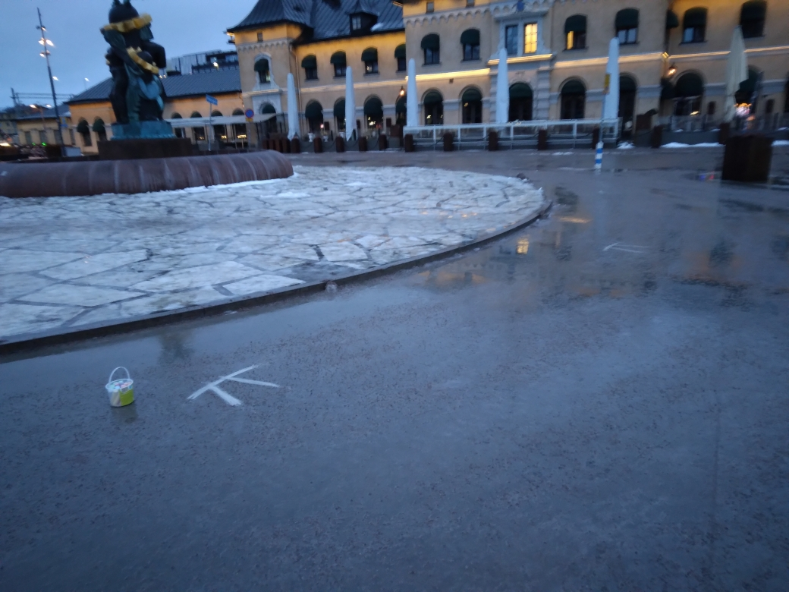
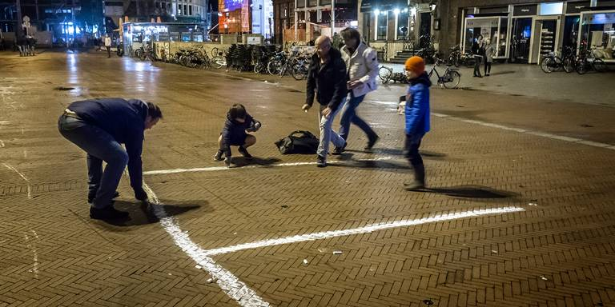

# Pi Day

 * What: Celebrate Pi Day, a yearly festivity (similar to [Pi Approximation Day](https://github.com/richelbilderbeek/pi_approximation_day))
 * When: at Pi Day (that is, March 14th)
    * 6:09: gather
    * 6:15: go!
    * (around) 7:00: back
 * Where: [Olof Palmes Plats, Uppsala](https://www.openstreetmap.org/search?query=pi%2C%20uppsala#map=19/59.85850/17.64579),
   which is at the central station (see map below)
 * To bring: a box of street chalk, knee protectors are recommended
 * Costs: a box of street chalk :-)

If rain is predicted, at 22:00 the day before, the event will be cancelled, 
which will be displayed in the status indicator here:

```
2025: Probably
```


## 2024

In 2024, I celebrated Pi Day together with NM and RM 
mostly close to the Olof Palmes Plats in Uppsala.


## 2023

In 2023, I celebrated Pi Day together with J and J in the Uppsala city center




As well, here is the beautiful masterwork by O.T.:


## 2022

In 2021, I celebrated Pi Day together with AH in the Uppsala city center:


## 2021

In 2021, I celebrated Pi Day by thinking deeply about it in Swedish.

## 2020

In 2020, I celebrated Pi Day together with BP and Q van der S-M, 
by drawing pi with streetchalk at the Groningen city center.

From [RTVNoord](https://www.rtvnoord.nl/nieuws/220010/Gewoon-shoppen-in-Corona-tijden-Je-kan-toch-moeilijk-maanden-thuiszitten):


DS celebrated Pi Day in his own fashion:


## 2019

In 2019, I celebrated Pi Day together with R de G and Q van der S-M, 
by drawing pi with streetchalk at the Groningen city center.

### [DVHN](https://www.dvhn.nl/groningen/Het-is-Pi-dag-Rich%C3%A8l-Bilderbeek-trekt-spoor-van-pis-door-Groninger-binnenstad-24265650.html)




### [RTVNoord](https://www.rtvnoord.nl/nieuws/206075/Sinterklaas-vieren-we-alleen-op-aarde-pi-dag-kan-in-het-hele-universum)


## 2018

In 2015, I celebrated Pi Day together with ? by drawing pi with streetchalk 
at the Groningen city center.


## 2017

Monday morning, 0:03, me and C.IJ. went out and drew pi symbols with street chalk.
We cannot prove this, as nobody put their pictures online where we could find them.

## 2016

In 2016, I celebrated Pi day together with ? by drawing pi with streetchalk 
at the Groningen city center.


 * [Tweet](https://twitter.com/ritzotencate/status/709280217119006720)

## 2015

In 2015, I celebrated Pi Day together with C.T. and W.S. by drawing pi with streetchalk 
at the Groningen city center.


 * [Tweet](https://twitter.com/roytammens/status/576714411647315968)


## 2014

In 2014 I celebrated Pi Day together with C.D. be drawing pi with streetchalk 
at the Groningen city center.


 * [Tweet](https://twitter.com/Nietzman/status/444385736465584128)


## 1694

I am unsure if in 1694 they went outside to draw pi symbols with streetchalk,
but I am pretty sure that they would have appreciated it.

Thanks to Jaap Beintema for sending me [this letter](pi.odt) 
from the Groningen archives:
 
> Christiaan Huygens aan W. Wichers
> 
> 15 juni 1694. 
> 
> Den WelEd. Gestrenghen Heere Mijn Heer W. Wichers, 
> Gedeputeerde ter Vergaderinghe van Haer Hoogmogende 
> tegenwoordigh tot Groningen. 
> 
>         WelEd: Gestrenghe Heer 
> 
>     Ick hebbe met UEd. seer aengenaeme ontfangen de gepretendeerde quadratura Circuli in twee gedruckte bladeren, die schijnen de laetste te sijn van een Tractaet, waer in den autheur oock de Duplicatio Cubi meent gevonden te hebben. Sijn naem blijft mij onbekent. Sijn wetenschap in de Geometrie moet niet veel wesen, dewijl hij eijndelijck besluyt dat de Circumferentie des Circels is tot den Diameter als 16 tot 5. 't welck al waere het een Engel uyt den Hemel die het seyde, geensins bij mij soude aengenomen werden, soo seecker weet ick het contrarie door veeler andere ende oock mijn eygene demonstratie. Soo dat het niet de pijne weerdt is nae te soecken, wat misslagh hij begaen heeft in de sijne, 't welck anders licht te vinden waere. 
Sijnde over enighe daegen bij de Heer Professor de Volder, seijde hij mij, dat de vacerende plaets tot Groeninghen van den Professor matheseos tot noch toe niet en was geremplisseert, 't welck mij heeft doen dencken of het door UEd. toedoen mochte geschiet sijn, om dat misschien noch gedachten hadde om den broeder van den Professor Bernoulli daertoe te beroepen, die ick om sijne sonderlinghe capaciteyt aen UWEd. gerecommandeert hebbe, en soo het tijdt is, nochmaels recommandeere, sijnd mij andersins onbekent. Het is mij leet dat de toestandt der saecken van de Provintie UWEd. niet eerder als seeckeren tijdt toe en laet wederom hier te komen resideren, welcke ick met verlanghen 
> te gemoet siende, sal mij gelukkigh achten indien ondertusschen occasie mocht hebben om door UWEd. te werden geemployeert als sijnde 
> 
>         Mijn Heer 
> 
> UWEd. seer oodtmoedigen Dienaer       
> Chr. Huygens.            
> 
>     Haghe den 15.e Jun. 1694. 

## Links

 * `https://bit.ly/pi_day_uppsala`
