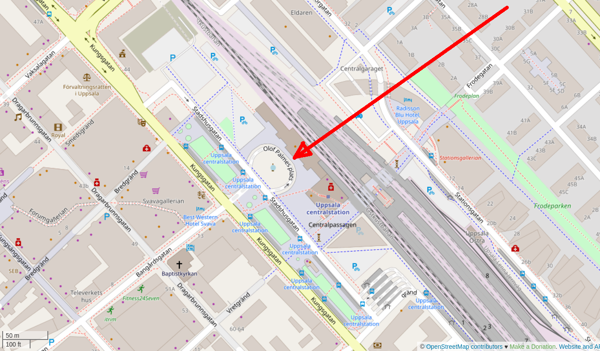

# Pi Day

 * What: Celebrate Pi Day, a yearly festivity
 * When: at Pi Day (that is, March 14th)
    * Gather: at sunrise, which is at 6:09
    * Leave: tau minutes later, 6:15
    * End: when all streetchalk has been used, approximately after an hour
 * Where: Olof Palmes Plats, Uppsala,
   which is at the central station (see map below)
 * To bring: a box of street chalk, knee protectors are recommended
 * Costs: a box of street chalk :-)

If rain is predicted, at 22:00 the day before, the event will be cancelled, 
which will be displayed at https://bit.ly/pi_day_uppsala

